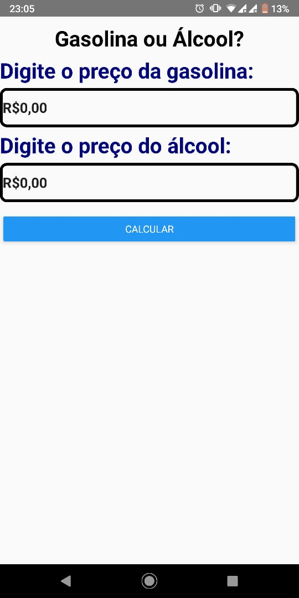
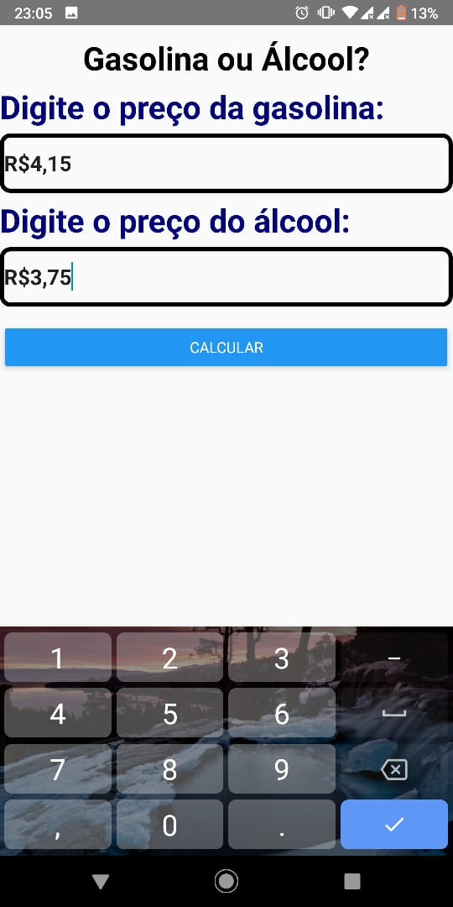
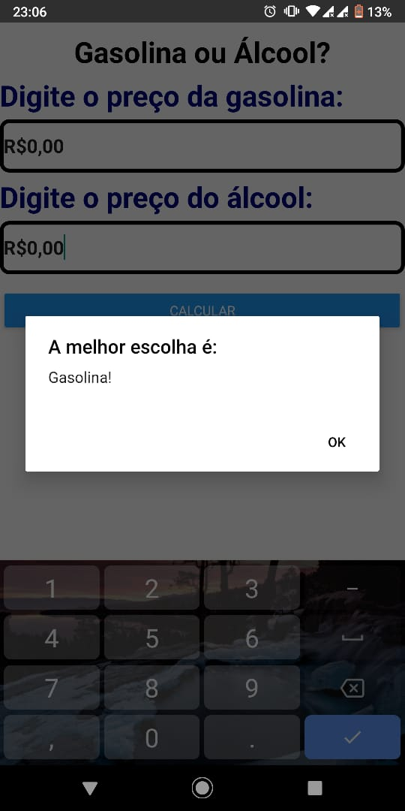

# App AorG - React Native
> Aplicativo desenvolvido como atividade na disciplina de Desenvolvimento de Aplicações Móveis - 2019.2

> App **internacionalizado** com suporte aos indiomas: _português_ e _inglês_

## Scrennshots

## Instalação do React Native

  - Siga a [documentação oficial]https://facebook.github.io/react-native/docs/getting-started, não tem como dá errado. :speak_no_evil:

## Rodando o App no emulador

  - Clone o [repositório]https://github.com/isaqueijs/App_Gasolina_ou_Alcool na sua estação de trabalho;
  - Inicie seu emulador;
  - Navegue até a pasta do projeto e instale as dependências:
    > npm i ou npm install
  - Instale o app no seu emulador:
    > **react-native run-android** ou **react-native run-ios**
      > Muitas vezes é necessário inicilizar o server do Node manualmente: **react-native start**.

## Histórico de lançamentos
* 0.0.1
    * Primeira versão, somente uma tela.

## Meta

Isaque João – isaqueijs@hotmail.com ou isaqueijs@gmail.com

[https://github.com/isaqueijs](https://github.com/isaqueijs)
